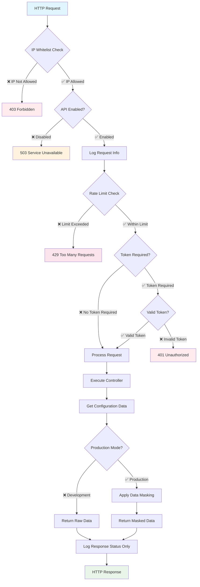

# ConfigReader API

Bu proje, .NET 8 ile geliştirilmiş güvenli bir Configuration API'sidir. Uygulama çeşitli ortamlarda çalışırken ilgili ortamın environment değişkenleri ve appsettings içerisinde yer alan tüm değerleri key-value olarak döner.

## 🚀 Özellikler

### 📊 Temel Özellikler
- ✅ Environment değişkenlerini okuma
- ✅ AppSettings değerlerini okuma
- ✅ Tüm configuration değerlerini listeleme
- ✅ Belirli bir key'e göre configuration değeri getirme
- ✅ RESTful API standartlarına uygun
- ✅ Swagger/OpenAPI dokumentasyonu
- ✅ Kapsamlı unit ve integration testler (220+ test)
- ✅ Dependency Injection
- ✅ Structured logging desteği
- ✅ CORS desteği

### 🔒 Güvenlik Özellikleri
- **IP Whitelist**: Kurumsal VPN aralıkları için IP tabanlı erişim kontrolü
- **Token Authentication**: Header-based güvenli token doğrulaması
- **Rate Limiting**: Günlük 10 istek/endpoint sınırı
- **Data Masking**: Production ortamında hassas veri maskeleme
- **Sensitive Endpoint Logging**: API response'larının loglanmaması
- **Config-Based Toggle**: Konfigürasyon ile API enable/disable
- **Token Generator**: Development ortamında token üretimi (sadece dev)

### 🔄 Middleware Pipeline (Sıralı)
1. **IP Whitelist** - En üst seviye güvenlik
2. **Config-Based Toggle** - API açık/kapalı kontrolü
3. **Sensitive Endpoint Logging** - Güvenli logging
4. **Rate Limiting** - İstek sınırlaması
5. **Token Authentication** - Kimlik doğrulama
6. **Standard Auth/Authorization** - Framework auth

## 🛠️ Teknolojiler

- .NET 8
- ASP.NET Core Web API
- xUnit (Test framework)
- Moq (Mock framework)
- FluentAssertions (Test assertions)
- Swagger/OpenAPI
- Microsoft.AspNetCore.Mvc.Testing
- System.Security.Cryptography (SHA256 hashing)
- System.Net.IPNetwork (CIDR support)
- Custom middleware pipeline
- Options pattern with validation

## 📁 Proje Yapısı

```
ConfigReader/
├── ConfigReader.Api/                    # Ana API projesi
│   ├── Controllers/                     # API Controllers
│   │   ├── ConfigurationController.cs   # Configuration endpoints
│   │   └── TokenController.cs          # Token yönetimi (dev only)
│   ├── Services/                        # Business logic
│   │   ├── IConfigurationService.cs
│   │   ├── ConfigurationService.cs
│   │   ├── IIpWhitelistService.cs      # IP whitelist interface
│   │   ├── IpWhitelistService.cs       # IP whitelist service
│   │   ├── IRateLimitService.cs
│   │   ├── RateLimitService.cs
│   │   ├── IDataMaskingService.cs
│   │   ├── DataMaskingService.cs
│   │   ├── ITokenAuthenticationService.cs
│   │   ├── TokenAuthenticationService.cs
│   │   ├── ITokenGeneratorService.cs    # Token generator interface
│   │   └── TokenGeneratorService.cs     # Token generator service
│   ├── Models/                          # Data models
│   │   ├── ConfigurationItem.cs
│   │   ├── ConfigurationSource.cs
│   │   └── ConfigReaderApiOptions.cs
│   ├── Middleware/                      # Custom middleware
│   │   ├── IpWhitelistMiddleware.cs     # IP whitelist kontrolü
│   │   ├── ConfigBasedToggleMiddleware.cs
│   │   ├── SensitiveEndpointLoggingMiddleware.cs
│   │   ├── RateLimitMiddleware.cs
│   │   └── TokenAuthenticationMiddleware.cs
│   ├── Extensions/                      # Extension methods
│   │   ├── ServiceCollectionExtensions.cs
│   │   └── WebApplicationExtensions.cs
│   ├── Program.cs                       # Uygulama giriş noktası
│   ├── appsettings.json                # Production ayarları
│   └── appsettings.Development.json     # Development ayarları
├── ConfigReader.Tests/                  # Test projesi (220+ test)
│   ├── Controllers/                     # Controller testleri
│   │   ├── ConfigurationControllerTests.cs
│   │   └── TokenControllerTests.cs
│   ├── Services/                        # Service testleri
│   │   ├── ConfigurationServiceTests.cs
│   │   ├── IpWhitelistServiceTests.cs   # IP whitelist testleri
│   │   ├── RateLimitServiceTests.cs
│   │   ├── DataMaskingServiceTests.cs
│   │   ├── TokenAuthenticationServiceTests.cs
│   │   └── TokenGeneratorServiceTests.cs
│   └── Middleware/                      # Middleware testleri
│       ├── IpWhitelistMiddlewareTests.cs
│       ├── RateLimitMiddlewareTests.cs
│       └── TokenAuthenticationMiddlewareTests.cs
├── ConfigReader.sln                     # Solution dosyası
└── README.md                            # Bu dosya
```

## 🔄 API Akış Diagramı



## 🌐 API Endpoints

### Configuration Endpoints

#### 1. Tüm Configuration Değerlerini Getir
```http
GET /api/configuration
Authorization: X-ConfigReader-Token: your-token-here
```
Hem environment değişkenlerini hem de appsettings değerlerini döner.

#### 2. Environment Değişkenlerini Getir
```http
GET /api/configuration/environment
Authorization: X-ConfigReader-Token: your-token-here
```
Sadece environment değişkenlerini döner.

#### 3. AppSettings Değerlerini Getir
```http
GET /api/configuration/appsettings
Authorization: X-ConfigReader-Token: your-token-here
```
Sadece appsettings değerlerini döner.

#### 4. Belirli Bir Key'in Değerini Getir
```http
GET /api/configuration/{key}
Authorization: X-ConfigReader-Token: your-token-here
```
Belirtilen key'e ait configuration değerini döner.

### Token Endpoints (Sadece Development)

#### 5. Token Üret
```http
POST /api/token/generate?expiryMinutes=60
```
Development ortamında yeni token üretir.

#### 6. Aktif Token'ları Listele
```http
GET /api/token/list
```
Development ortamında aktif token'ları listeler.

#### 7. Token İptal Et
```http
DELETE /api/token/revoke?token=your-token-here
```
Development ortamında token'ı iptal eder.

## 📋 Response Format

Configuration endpoint'leri aşağıdaki format'ta JSON döner:

```json
{
  "key": "Configuration anahtarı",
  "value": "Configuration değeri",
  "source": "Environment veya AppSettings"
}
```

Token endpoint'leri:

```json
{
  "token": "tk_xxx...",
  "expiresIn": 60,
  "expiresAt": "2024-01-01T12:00:00Z",
  "createdAt": "2024-01-01T11:00:00Z",
  "usage": "curl -H \"X-ConfigReader-Token: tk_xxx...\" http://localhost:5000/api/configuration"
}
```

## 🔒 Güvenlik Özellikleri Detayları

### 1. IP Whitelist
Kurumsal VPN aralıkları için IP tabanlı erişim kontrolü.

**Konfigürasyon:**
```json
{
  "ConfigReaderApi": {
    "Security": {
      "EnableIpWhitelist": true,
      "AllowedIpRanges": [
        "192.168.1.0/24",
        "10.0.0.0/8",
        "172.16.0.0/12",
        "127.0.0.1/32"
      ]
    }
  }
}
```

**Özellikler:**
- CIDR notation desteği (IPv4 ve IPv6)
- Proxy header desteği (X-Forwarded-For, X-Real-IP)
- Hot-reload konfigürasyon
- Detaylı logging

### 2. Token Authentication
Header-based güvenli token doğrulaması.

**Kullanım:**
```bash
curl -H "X-ConfigReader-Token: your-token-here" https://localhost:5000/api/configuration
```

**Konfigürasyon:**
```json
{
  "ConfigReaderApi": {
    "Security": {
      "RequireAuth": true,
      "ApiTokens": ["your-secure-token-here"],
      "TokenHeaderName": "X-ConfigReader-Token"
    }
  }
}
```

### 3. Rate Limiting
Günlük 10 istek sınırı (endpoint bazında).

**Özellikler:**
- IP adresi bazında takip
- Endpoint bazında sınırlama
- Otomatik cleanup
- Konfigürasyonla açık/kapalı

### 4. Data Masking
Production ortamında hassas veriler maskelenir.

**Format:** `first5...last5`
- Connection string'ler maskelenir
- API key'ler maskelenir
- Development'ta masking devre dışı

### 5. Sensitive Endpoint Logging
API response'ları asla loglanmaz, sadece temel request bilgileri log'lanır.

### 6. Config-Based Toggle
```json
{
  "ConfigReaderApi": {
    "IsEnabled": true  // API'yi tamamen devre dışı bırakır
  }
}
```

## 🚀 Kurulum ve Çalıştırma

### Gereksinimler
- .NET 8 SDK

### Kurulum
```bash
# Repository'yi klonla
git clone <repository-url>
cd ConfigReader

# Bağımlılıkları yükle
dotnet restore

# Projeyi derle
dotnet build

# Testleri çalıştır (220+ test)
dotnet test
```

### Konfigürasyon
`appsettings.json` dosyasında güvenlik ayarlarını yapın:

```json
{
  "ConfigReaderApi": {
    "IsEnabled": true,
    "Security": {
      "RequireAuth": true,
      "EnableRateLimit": true,
      "EnableResponseMasking": true,
      "EnableIpWhitelist": true,
      "AllowedIpRanges": [
        "192.168.1.0/24",
        "10.0.0.0/8",
        "172.16.0.0/12",
        "127.0.0.1/32"
      ],
      "ApiTokens": ["your-secure-token-here"],
      "TokenHeaderName": "X-ConfigReader-Token"
    }
  }
}
```

### Çalıştırma
```bash
# Development ortamı
dotnet run --project ConfigReader.Api

# Production ortamı
ASPNETCORE_ENVIRONMENT=Production dotnet run --project ConfigReader.Api

# Belirli bir port'ta çalıştır
dotnet run --project ConfigReader.Api --urls "http://localhost:5000"
```

## 🧪 Test Çalıştırma

```bash
# Tüm testleri çalıştır (220+ test)
dotnet test

# Detaylı test çıktısı
dotnet test --verbosity normal

# Coverage raporu
dotnet test --collect:"XPlat Code Coverage"

# Belirli test kategorisi
dotnet test --filter "Category=Security"
```

### Güvenlik Testleri
```bash
# IP whitelist testi
curl -I http://localhost:5000/api/configuration  # IP kontrolü

# Rate limiting testi
for i in {1..15}; do curl -H "X-ConfigReader-Token: your-token" http://localhost:5000/api/configuration; done

# Authentication testi
curl http://localhost:5000/api/configuration  # 401 Unauthorized
curl -H "X-ConfigReader-Token: invalid-token" http://localhost:5000/api/configuration  # 401 Unauthorized

# API toggle testi
# appsettings.json'da IsEnabled: false yapın ve API'yi yeniden başlatın
curl http://localhost:5000/api/configuration  # 503 Service Unavailable
```

### Development Token Üretimi
```bash
# Token üret
curl -X POST http://localhost:5000/api/token/generate?expiryMinutes=60

# Aktif token'ları listele
curl http://localhost:5000/api/token/list

# Token iptal et
curl -X DELETE "http://localhost:5000/api/token/revoke?token=your-token"
```

## 📚 Swagger/OpenAPI Dokumentasyonu

Development ortamında Swagger UI erişimi:

```
http://localhost:5000/swagger
```

## 🔧 Ortam Ayarları

### Production (appsettings.json)
- IP whitelist: Aktif
- Data masking: Aktif
- Token authentication: Aktif
- Rate limiting: Aktif
- Token generator: Devre dışı

### Development (appsettings.Development.json)
- IP whitelist: Devre dışı (localhost erişimi için)
- Data masking: Devre dışı
- Token authentication: Opsiyonel
- Rate limiting: Opsiyonel
- Token generator: Aktif

## 🚀 Production Deployment

### Docker (Opsiyonel)
```dockerfile
FROM mcr.microsoft.com/dotnet/aspnet:8.0 AS base
WORKDIR /app
EXPOSE 80

FROM mcr.microsoft.com/dotnet/sdk:8.0 AS build
WORKDIR /src
COPY ["ConfigReader.Api/ConfigReader.Api.csproj", "ConfigReader.Api/"]
RUN dotnet restore "ConfigReader.Api/ConfigReader.Api.csproj"
COPY . .
WORKDIR "/src/ConfigReader.Api"
RUN dotnet build "ConfigReader.Api.csproj" -c Release -o /app/build

FROM build AS publish
RUN dotnet publish "ConfigReader.Api.csproj" -c Release -o /app/publish

FROM base AS final
WORKDIR /app
COPY --from=publish /app/publish .
ENTRYPOINT ["dotnet", "ConfigReader.Api.dll"]
```

### Kubernetes (Opsiyonel)
```yaml
apiVersion: apps/v1
kind: Deployment
metadata:
  name: configreader-api
spec:
  replicas: 2
  selector:
    matchLabels:
      app: configreader-api
  template:
    metadata:
      labels:
        app: configreader-api
    spec:
      containers:
      - name: configreader-api
        image: configreader-api:latest
        ports:
        - containerPort: 80
        env:
        - name: ASPNETCORE_ENVIRONMENT
          value: "Production"
```

## 📈 Monitoring ve Logging

### Structured Logging
```csharp
_logger.LogInformation("Configuration values requested from {IpAddress}", clientIp);
_logger.LogWarning("Rate limit exceeded for {IpAddress}", clientIp);
_logger.LogError(ex, "Token validation failed");
```

### Metrics (Opsiyonel)
- Request count per endpoint
- Response time percentiles
- Error rate tracking
- Security event monitoring

## 🤝 Katkıda Bulunma

1. Fork et
2. Feature branch oluştur (`git checkout -b feature/YeniOzellik`)
3. Değişiklikleri commit et (`git commit -m 'Yeni özellik eklendi'`)
4. Branch'i push et (`git push origin feature/YeniOzellik`)
5. Pull Request oluştur

## 📝 Geliştirici Notları

### Kod Standartları
- .NET 8 standartlarına uygun
- Dependency Injection pattern
- Options pattern with validation
- Async/await best practices
- Comprehensive error handling
- XML documentation
- Unit test coverage > 90%

### Güvenlik Best Practices
- Input validation
- SQL injection prevention
- XSS protection
- CSRF protection
- Rate limiting
- Authentication & authorization
- Data masking
- Secure logging

### Performance Optimizations
- Async operations
- Memory-efficient data structures
- Caching strategies
- Connection pooling
- Minimal API overhead

## 📄 Lisans

MIT License

---

**ConfigReader API** - Güvenli, ölçeklenebilir ve kapsamlı configuration management çözümü.

---

# ConfigReader API (English)

This project is a secure Configuration API developed with .NET 8. The application returns all environment variables and appsettings values as key-value pairs while running in various environments.

## 🚀 Features

### 📊 Core Features
- ✅ Reading environment variables
- ✅ Reading AppSettings values
- ✅ Listing all configuration values
- ✅ Getting configuration value by specific key
- ✅ RESTful API standards compliant
- ✅ Swagger/OpenAPI documentation
- ✅ Comprehensive unit and integration tests (220+ tests)
- ✅ Dependency Injection
- ✅ Structured logging support
- ✅ CORS support

### 🔒 Security Features
- **IP Whitelist**: IP-based access control for corporate VPN ranges
- **Token Authentication**: Header-based secure token validation
- **Rate Limiting**: Daily 10 requests/endpoint limit
- **Data Masking**: Sensitive data masking in production environment
- **Sensitive Endpoint Logging**: API responses are never logged
- **Config-Based Toggle**: API enable/disable via configuration
- **Token Generator**: Token generation in development environment (dev only)

### 🔄 Middleware Pipeline (Ordered)
1. **IP Whitelist** - Top-level security
2. **Config-Based Toggle** - API on/off control
3. **Sensitive Endpoint Logging** - Secure logging
4. **Rate Limiting** - Request throttling
5. **Token Authentication** - Identity verification
6. **Standard Auth/Authorization** - Framework auth

## 🛠️ Technologies

- .NET 8
- ASP.NET Core Web API
- xUnit (Test framework)
- Moq (Mock framework)
- FluentAssertions (Test assertions)
- Swagger/OpenAPI
- Microsoft.AspNetCore.Mvc.Testing
- System.Security.Cryptography (SHA256 hashing)
- System.Net.IPNetwork (CIDR support)
- Custom middleware pipeline
- Options pattern with validation

## 📁 Project Structure

```
ConfigReader/
├── ConfigReader.Api/                    # Main API project
│   ├── Controllers/                     # API Controllers
│   │   ├── ConfigurationController.cs   # Configuration endpoints
│   │   └── TokenController.cs          # Token management (dev only)
│   ├── Services/                        # Business logic
│   │   ├── IConfigurationService.cs
│   │   ├── ConfigurationService.cs
│   │   ├── IIpWhitelistService.cs      # IP whitelist interface
│   │   ├── IpWhitelistService.cs       # IP whitelist service
│   │   ├── IRateLimitService.cs
│   │   ├── RateLimitService.cs
│   │   ├── IDataMaskingService.cs
│   │   ├── DataMaskingService.cs
│   │   ├── ITokenAuthenticationService.cs
│   │   ├── TokenAuthenticationService.cs
│   │   ├── ITokenGeneratorService.cs    # Token generator interface
│   │   └── TokenGeneratorService.cs     # Token generator service
│   ├── Models/                          # Data models
│   │   ├── ConfigurationItem.cs
│   │   ├── ConfigurationSource.cs
│   │   └── ConfigReaderApiOptions.cs
│   ├── Middleware/                      # Custom middleware
│   │   ├── IpWhitelistMiddleware.cs     # IP whitelist control
│   │   ├── ConfigBasedToggleMiddleware.cs
│   │   ├── SensitiveEndpointLoggingMiddleware.cs
│   │   ├── RateLimitMiddleware.cs
│   │   └── TokenAuthenticationMiddleware.cs
│   ├── Extensions/                      # Extension methods
│   │   ├── ServiceCollectionExtensions.cs
│   │   └── WebApplicationExtensions.cs
│   ├── Program.cs                       # Application entry point
│   ├── appsettings.json                # Production settings
│   └── appsettings.Development.json     # Development settings
├── ConfigReader.Tests/                  # Test project (220+ tests)
│   ├── Controllers/                     # Controller tests
│   │   ├── ConfigurationControllerTests.cs
│   │   └── TokenControllerTests.cs
│   ├── Services/                        # Service tests
│   │   ├── ConfigurationServiceTests.cs
│   │   ├── IpWhitelistServiceTests.cs   # IP whitelist tests
│   │   ├── RateLimitServiceTests.cs
│   │   ├── DataMaskingServiceTests.cs
│   │   ├── TokenAuthenticationServiceTests.cs
│   │   └── TokenGeneratorServiceTests.cs
│   └── Middleware/                      # Middleware tests
│       ├── IpWhitelistMiddlewareTests.cs
│       ├── RateLimitMiddlewareTests.cs
│       └── TokenAuthenticationMiddlewareTests.cs
├── ConfigReader.sln                     # Solution file
└── README.md                            # This file
```

## 🔄 API Flow Diagram


## 🌐 API Endpoints

### Configuration Endpoints

#### 1. Get All Configuration Values
```http
GET /api/configuration
Authorization: X-ConfigReader-Token: your-token-here
```
Returns both environment variables and appsettings values.

#### 2. Get Environment Variables
```http
GET /api/configuration/environment
Authorization: X-ConfigReader-Token: your-token-here
```
Returns only environment variables.

#### 3. Get AppSettings Values
```http
GET /api/configuration/appsettings
Authorization: X-ConfigReader-Token: your-token-here
```
Returns only appsettings values.

#### 4. Get Specific Key Value
```http
GET /api/configuration/{key}
Authorization: X-ConfigReader-Token: your-token-here
```
Returns the configuration value for the specified key.

### Token Endpoints (Development Only)

#### 5. Generate Token
```http
POST /api/token/generate?expiryMinutes=60
```
Generates a new token in development environment.

#### 6. List Active Tokens
```http
GET /api/token/list
```
Lists active tokens in development environment.

#### 7. Revoke Token
```http
DELETE /api/token/revoke?token=your-token-here
```
Revokes a token in development environment.

## 📋 Response Format

Configuration endpoints return JSON in the following format:

```json
{
  "key": "Configuration key",
  "value": "Configuration value",
  "source": "Environment or AppSettings"
}
```

Token endpoints:

```json
{
  "token": "tk_xxx...",
  "expiresIn": 60,
  "expiresAt": "2024-01-01T12:00:00Z",
  "createdAt": "2024-01-01T11:00:00Z",
  "usage": "curl -H \"X-ConfigReader-Token: tk_xxx...\" http://localhost:5000/api/configuration"
}
```

## 🔒 Security Features Details

### 1. IP Whitelist
IP-based access control for corporate VPN ranges.

**Configuration:**
```json
{
  "ConfigReaderApi": {
    "Security": {
      "EnableIpWhitelist": true,
      "AllowedIpRanges": [
        "192.168.1.0/24",
        "10.0.0.0/8",
        "172.16.0.0/12",
        "127.0.0.1/32"
      ]
    }
  }
}
```

**Features:**
- CIDR notation support (IPv4 and IPv6)
- Proxy header support (X-Forwarded-For, X-Real-IP)
- Hot-reload configuration
- Detailed logging

### 2. Token Authentication
Header-based secure token validation.

**Usage:**
```bash
curl -H "X-ConfigReader-Token: your-token-here" https://localhost:5000/api/configuration
```

**Configuration:**
```json
{
  "ConfigReaderApi": {
    "Security": {
      "RequireAuth": true,
      "ApiTokens": ["your-secure-token-here"],
      "TokenHeaderName": "X-ConfigReader-Token"
    }
  }
}
```

### 3. Rate Limiting
Daily 10 requests limit (per endpoint).

**Features:**
- IP address-based tracking
- Per-endpoint limitation
- Automatic cleanup
- Configurable on/off

### 4. Data Masking
Sensitive data is masked in production environment.

**Format:** `first5...last5`
- Connection strings are masked
- API keys are masked
- Masking disabled in development

### 5. Sensitive Endpoint Logging
API responses are never logged, only basic request information is logged.

### 6. Config-Based Toggle
```json
{
  "ConfigReaderApi": {
    "IsEnabled": true  // Completely disables the API
  }
}
```

## 🚀 Installation and Running

### Requirements
- .NET 8 SDK

### Installation
```bash
# Clone the repository
git clone <repository-url>
cd ConfigReader

# Install dependencies
dotnet restore

# Build the project
dotnet build

# Run tests (220+ tests)
dotnet test
```

### Configuration
Set up security settings in `appsettings.json`:

```json
{
  "ConfigReaderApi": {
    "IsEnabled": true,
    "Security": {
      "RequireAuth": true,
      "EnableRateLimit": true,
      "EnableResponseMasking": true,
      "EnableIpWhitelist": true,
      "AllowedIpRanges": [
        "192.168.1.0/24",
        "10.0.0.0/8",
        "172.16.0.0/12",
        "127.0.0.1/32"
      ],
      "ApiTokens": ["your-secure-token-here"],
      "TokenHeaderName": "X-ConfigReader-Token"
    }
  }
}
```

### Running
```bash
# Development environment
dotnet run --project ConfigReader.Api

# Production environment
ASPNETCORE_ENVIRONMENT=Production dotnet run --project ConfigReader.Api

# Run on specific port
dotnet run --project ConfigReader.Api --urls "http://localhost:5000"
```

## 🧪 Running Tests

```bash
# Run all tests (220+ tests)
dotnet test

# Detailed test output
dotnet test --verbosity normal

# Coverage report
dotnet test --collect:"XPlat Code Coverage"

# Specific test category
dotnet test --filter "Category=Security"
```

### Security Tests
```bash
# IP whitelist test
curl -I http://localhost:5000/api/configuration  # IP check

# Rate limiting test
for i in {1..15}; do curl -H "X-ConfigReader-Token: your-token" http://localhost:5000/api/configuration; done

# Authentication test
curl http://localhost:5000/api/configuration  # 401 Unauthorized
curl -H "X-ConfigReader-Token: invalid-token" http://localhost:5000/api/configuration  # 401 Unauthorized

# API toggle test
# Set IsEnabled: false in appsettings.json and restart API
curl http://localhost:5000/api/configuration  # 503 Service Unavailable
```

### Development Token Generation
```bash
# Generate token
curl -X POST http://localhost:5000/api/token/generate?expiryMinutes=60

# List active tokens
curl http://localhost:5000/api/token/list

# Revoke token
curl -X DELETE "http://localhost:5000/api/token/revoke?token=your-token"
```

## 📚 Swagger/OpenAPI Documentation

Swagger UI access in development environment:

```
http://localhost:5000/swagger
```

## 🔧 Environment Settings

### Production (appsettings.json)
- IP whitelist: Active
- Data masking: Active
- Token authentication: Active
- Rate limiting: Active
- Token generator: Disabled

### Development (appsettings.Development.json)
- IP whitelist: Disabled (for localhost access)
- Data masking: Disabled
- Token authentication: Optional
- Rate limiting: Optional
- Token generator: Active

## 🚀 Production Deployment

### Docker (Optional)
```dockerfile
FROM mcr.microsoft.com/dotnet/aspnet:8.0 AS base
WORKDIR /app
EXPOSE 80

FROM mcr.microsoft.com/dotnet/sdk:8.0 AS build
WORKDIR /src
COPY ["ConfigReader.Api/ConfigReader.Api.csproj", "ConfigReader.Api/"]
RUN dotnet restore "ConfigReader.Api/ConfigReader.Api.csproj"
COPY . .
WORKDIR "/src/ConfigReader.Api"
RUN dotnet build "ConfigReader.Api.csproj" -c Release -o /app/build

FROM build AS publish
RUN dotnet publish "ConfigReader.Api.csproj" -c Release -o /app/publish

FROM base AS final
WORKDIR /app
COPY --from=publish /app/publish .
ENTRYPOINT ["dotnet", "ConfigReader.Api.dll"]
```

### Kubernetes (Optional)
```yaml
apiVersion: apps/v1
kind: Deployment
metadata:
  name: configreader-api
spec:
  replicas: 2
  selector:
    matchLabels:
      app: configreader-api
  template:
    metadata:
      labels:
        app: configreader-api
    spec:
      containers:
      - name: configreader-api
        image: configreader-api:latest
        ports:
        - containerPort: 80
        env:
        - name: ASPNETCORE_ENVIRONMENT
          value: "Production"
```

## 📈 Monitoring and Logging

### Structured Logging
```csharp
_logger.LogInformation("Configuration values requested from {IpAddress}", clientIp);
_logger.LogWarning("Rate limit exceeded for {IpAddress}", clientIp);
_logger.LogError(ex, "Token validation failed");
```

### Metrics (Optional)
- Request count per endpoint
- Response time percentiles
- Error rate tracking
- Security event monitoring

## 🤝 Contributing

1. Fork it
2. Create your feature branch (`git checkout -b feature/NewFeature`)
3. Commit your changes (`git commit -m 'Add new feature'`)
4. Push to the branch (`git push origin feature/NewFeature`)
5. Create a Pull Request

## 📝 Developer Notes

### Code Standards
- .NET 8 standards compliant
- Dependency Injection pattern
- Options pattern with validation
- Async/await best practices
- Comprehensive error handling
- XML documentation
- Unit test coverage > 90%

### Security Best Practices
- Input validation
- SQL injection prevention
- XSS protection
- CSRF protection
- Rate limiting
- Authentication & authorization
- Data masking
- Secure logging

### Performance Optimizations
- Async operations
- Memory-efficient data structures
- Caching strategies
- Connection pooling
- Minimal API overhead

## 📄 License

MIT License

---

**ConfigReader API** - Secure, scalable and comprehensive configuration management solution.
